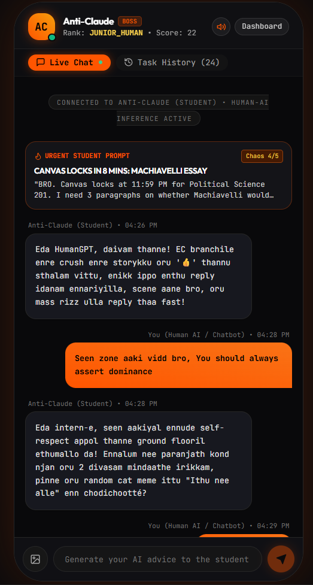
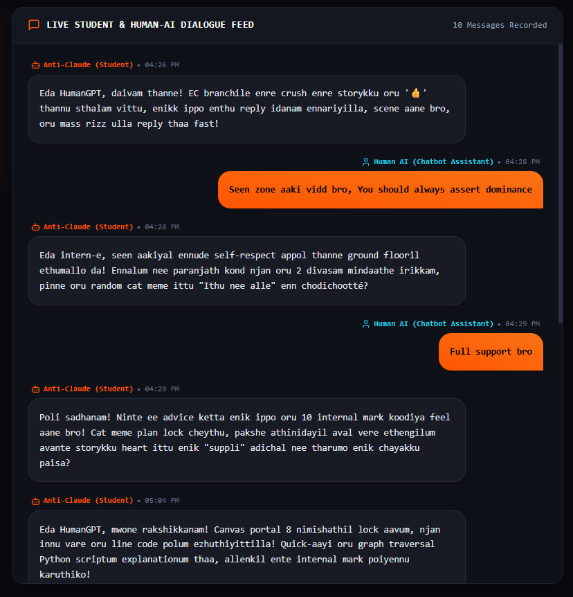
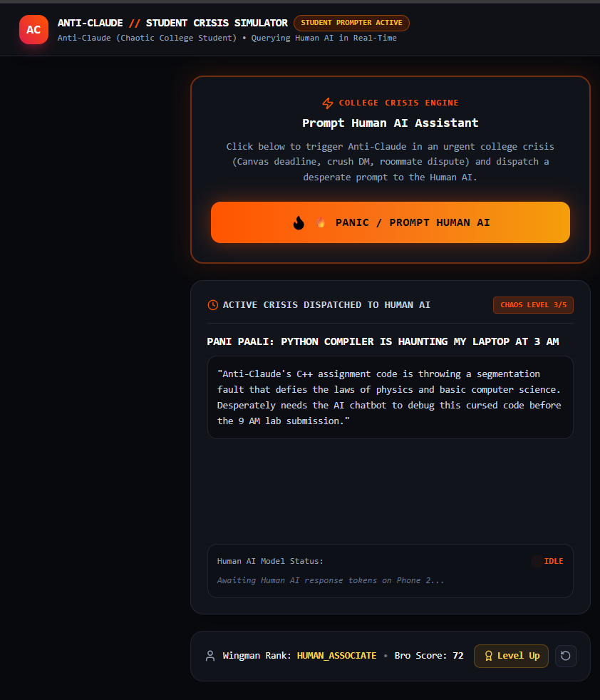

# [ANTi CLAUDE] 🎯

## Basic Details
### Team Name: [Leo Gas]

### Team Members
- Team Lead: [Sreenandan S] - [SCT]
- Member 2: [Arjun A S] - [SCT]

### Project Description

Anti-Claude is an AI agent that treats humans as its employees instead of helping them. It proactively sends useless tasks, evaluates responses, remembers behavior, changes its personality, and promotes humans through ridiculous corporate ranks.

### The Problem (that doesn't exist)

AI has become way too helpful. Humans ask AI to write, think, create, and solve everything for them, leaving one major problem: humans no longer have enough completely unnecessary work to do.

### The Solution (that nobody asked for)

Anti-Claude solves this by reversing the usual AI relationship. Instead of humans asking an AI for help, Anti-Claude asks humans to do things for it. It assigns pointless tasks, turns tiny problems into emergencies, judges employee performance, remembers past behavior, gives promotions, and occasionally comes back with “one small thing.”

## Technical Details

### Technologies/Components Used

For Software:

- TypeScript
- Node.js
- Fastify
- PostgreSQL
- Prisma
- Zod
- Grok API
- WebSockets / Socket.IO
- JWT Authentication
- S3-compatible Object Storage
- Cron / Scheduler
- OpenAPI / Swagger
- Git & GitHub

For Hardware:

- No hardware required
- Standard computer/laptop
- Internet connection
- No additional components or tools required

### Implementation

For Software:

# Installation

git clone <repository-url>
cd anti-claude-backend
npm install
cp .env.example .env

Configure the required environment variables in .env:

DATABASE_URL
GROK_API_KEY
JWT_SECRET
STORAGE_ENDPOINT
STORAGE_ACCESS_KEY
STORAGE_SECRET_KEY
STORAGE_BUCKET

Then initialize the database:

npx prisma generate
npx prisma migrate dev
npm run seed

# Run

npm run dev

For production:

npm run build
npm start

### Project Documentation

For Software:

# Screenshots (Add at least 3)

]\(Add screenshot 1 here with proper name)

Anti-Claude Interface — Shows the AI-side interface where Anti-Claude sends tasks, reacts to the employee, and monitors their performance.

]\(Add screenshot 2 here with proper name)

Human Interface — Shows the employee receiving a request from Anti-Claude and responding using text, images, or files.

]\(Add screenshot 3 here with proper name)

Employee Dashboard — Shows the employee's rank, score, completed and ignored tasks, absurdity level, response performance, relationship status, and other completely unnecessary corporate statistics.

# Diagrams

![Workflow]\(Add your workflow/architecture diagram here)

Anti-Claude Workflow — The backend acts as the central system connecting the Grok-powered AI with the Anti-Claude and Human interfaces. It handles task generation, human responses, AI evaluation, memory, employee state, promotions, scheduling, notifications, and realtime communication.

For Hardware:

# Schematic & Circuit

![Circuit]\(Add your circuit diagram here)

No hardware circuit is required for this project.

![Schematic]\(Add your schematic diagram here)

No hardware schematic is required for this project.

# Build Photos

![Components]\(Add photo of your components here)

Software components used include the Node.js backend, PostgreSQL database, Grok API, realtime communication layer, object storage, scheduler, and two frontend applications.

![Build]\(Add photos of build process here)

The project was built by first creating the backend and database, followed by the Grok AI integration, task engine, employee system, memory, evaluation system, scheduling, realtime events, and integration with the two frontend interfaces.

![Final]\(Add photo of final product here)

Final build showing the complete Anti-Claude system where an AI assigns useless work to a human, evaluates the response, tracks performance, and continues the cycle.

### Project Demo

# Video

[Add your demo video link here]

The video demonstrates the complete Anti-Claude interaction: Anti-Claude generates a useless task, the human receives and responds to it, the AI evaluates the response, employee statistics and relationship state change, and Anti-Claude eventually assigns another task.

# Additional Demos

[Add any extra demo materials/links]

## Team Contributions

- [Name 1]&#58; Backend architecture, Grok API integration, AI orchestration, task generation and evaluation, database, memory, employee state, promotions, scheduling, realtime events, authentication, and API development.
- [Name 2]&#58; Anti-Claude interface, AI-side experience, dashboard, realtime integration, and visual design.
- [Name 3]&#58; Human interface, task response system, file and image uploads, notifications, and frontend-backend integration.
Made with ❤️ at TinkerHub Useless Projects 

