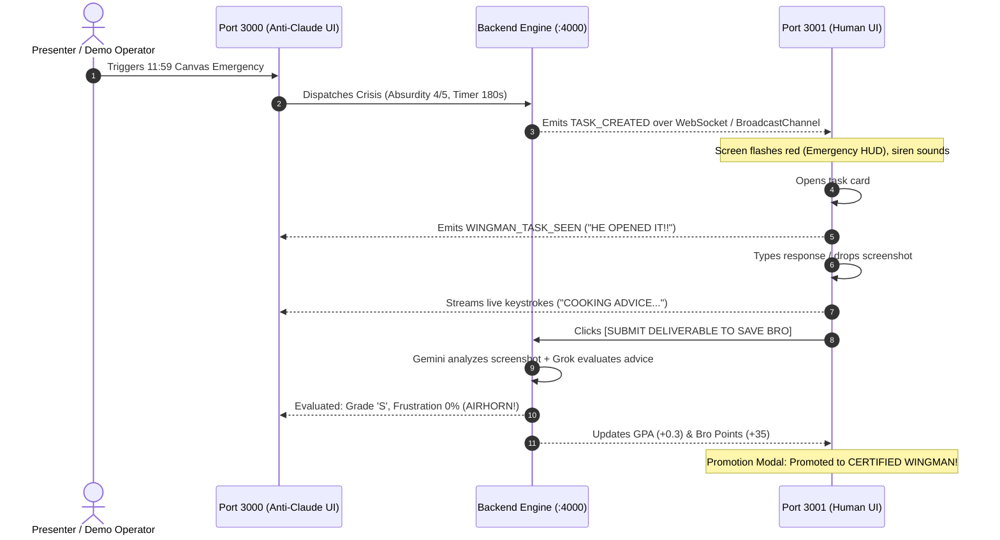

```
◆ ─ │ ─ ─ ─ │ ─ ─ ─ ─ │ ─ ─ ─ │ ─ ─ │ ─ │ ─ ─ │ ─ ◆

  intent.

  Make the reason behind every decision visible.

  What are you designing, and for whom?

◆ ─ │ ─ ─ ─ │ ─ ─ ─ ─ │ ─ ─ ─ │ ─ ─ │ ─ │ ─ ─ │ ─ ◆
```

# ANTI-CLAUDE — DESIGN WITH INTENT SPECIFICATION

> **Document Version:** 1.0.0  
> **Framework:** Intent UX Design Strategy System (`ghaida/intent`)  
> **Skills Applied:** `/intent`, `/journey`, `/wireframe`, `/articulate`, `/fortify`, `/include`, `/organize`  
> **Target Surfaces:** Dual-Screen Application (`:3000` Anti-Claude Dorm Cockpit & `:3001` Human Wingman Hotline)

---

## 1. Intent Context & Strategic Framing (`/intent`)

Anti-Claude is an **inverted human-AI dynamic simulation**. A normal AI assistant sits waiting passively for user prompts. Anti-Claude inverts this: the AI is an overwhelmed, panicked, caffeine-overdosed undergraduate college student who bombards the human with urgent real-life crises (11:59 Canvas deadlines, crush DMs, roommate microwave disputes, syllabus extension pleas).

### The Three Actors
1. **The Panicked Student (Anti-Claude — Port 3000):** Overwhelmed, ADHD energy, dramatic, emotionally volatile, desperate for human salvation.
2. **The Unpaid Wingman (The Human — Port 3001):** Roommate on-call, receiving emergency pings, typing advice, uploading screenshots, tracking Bro Standing and GPA.
3. **The Hackathon Judge / Spectator:** Watching both screens side-by-side during a 3-minute live pitch. The UI must show immediate cause-and-effect: *keystroke on Port 3001 $\rightarrow$ instant twitching telemetry on Port 3000*.

---

## 2. Cross-Surface User Journey (`/journey`)

The user journey is a synchronized, bidirectional loop across two screens:



### Critical Journey States

| Stage | Port 3000 (Anti-Claude UI) Experience | Port 3001 (Human Wingman UI) Experience |
| :--- | :--- | :--- |
| **1. Idle / Anticipation** | Caffeine meter full, resting heart rate (138 bpm), terminal idling. | Standby mode, Student ID card displayed, past receipts visible. |
| **2. Crisis Dispatched** | Canvas clock ticks down from 180s, Grok thought tokens stream. | Discord ping sounds, emergency card slides in with pulsing border. |
| **3. Wingman Working** | Surveillance status switches to `COOKING ADVICE`, live keystrokes visible. | Text editor active, screenshot dropzone ready, countdown ticking. |
| **4. Ingestion & Analysis** | Terminal prints *"Gemini inspecting screenshot... Grok reading advice"*. | Submit button switches to *"Transmitting deliverable to Anti-Claude..."*. |
| **5. Meltdown or Praise** | If bad: unhinged all-caps rant. If good: *"BRO YOU ARE A DEMON"*. | S/F report card received, sound effect plays, GPA & Bro points adjust. |
| **6. Milestone Ascension** | Dorm Hall of Fame updates. | Full-screen Promotion Modal: *"ELEVATED TO CERTIFIED WINGMAN"* + Airhorn. |

---

## 3. Structural Wireframe Anatomy (`/wireframe`)

### Surface A: Anti-Claude Dorm Cockpit (`http://localhost:3000`)

```text
┌──────────────────────────────────────────────────────────────────────────────┐
│ [🔥 ANTI-CLAUDE // DORM COCKPIT]               [STATUS: DOWN BAD] [SFX: ON]  │
├──────────────────────────┬───────────────────────────┬───────────────────────┤
│ ZONE 1: BIOLOGICAL STATE │ ZONE 2: CRISIS DISPATCH   │ ZONE 3: CAMPUS RADAR  │
│                          │                           │                       │
│ ┌──────────────────────┐ │ ┌───────────────────────┐ │ ┌───────────────────┐ │
│ │ Anxiety: 94% [█████] │ │ │ Canvas Portal: 02:47  │ │ │ Crush Tracker:    │ │
│ │ Monster: 4 cans      │ │ │ "Pol Sci 201 Term"    │ │ │ Maya K. (Econ 101)│ │
│ │ Heart Rate: 138 BPM  │ │ └───────────────────────┘ │ │ "Left on Read 24m"│ │
│ └──────────────────────┘ │                           │ └───────────────────┘ │
│                          │ ┌───────────────────────┐ │                       │
│ ┌──────────────────────┐ │ │ Active Crisis Card:   │ │ ┌───────────────────┐ │
│ │ Panic Terminal:      │ │ │ "Hobbes vs TikTok"    │ │ │ Meltdown Feed:    │ │
│ │ • Grok thoughts      │ │ │ Category: Academic    │ │ │ • Grade S: +35pts │ │
│ │ • Canvas scrapers    │ │ └───────────────────────┘ │ │ • Grade F Roast   │ │
│ │ • Internal dread log │ │                           │ │ • Frustration: 98%│ │
│ │                      │ │ ┌───────────────────────┐ │ │   "BRO WHAT IS    │ │
│ │                      │ │ │ Wingman Spy:          │ │ │    THIS?! COOKED!"│ │
│ │                      │ │ │ Status: COOKING...    │ │ └───────────────────┘ │
│ │                      │ │ │ Draft: "Hobbes would" │ │                       │
│ └──────────────────────┘ │ └───────────────────────┘ │                       │
├──────────────────────────┴───────────────────────────┴───────────────────────┤
│ [🚨 11:59 CANVAS LOCK]  [💬 CRUSH DM PANIC]  [🍕 MICROWAVE WAR]  [📈 PROMOTION] │
└──────────────────────────────────────────────────────────────────────────────┘
```

### Surface B: Human Wingman Hotline (`http://localhost:3001`)

```text
┌──────────────────────────────────────────────────────────────────────────────┐
│ [🛡️ WINGMAN HOTLINE // STUDENT 911]           [DND: SLEEP MODE] [SFX] [OPEN] │
├──────────────────────────────┬───────────────────────────────────────────────┤
│ ZONE 1: WINGMAN DOSSIER      │ ZONE 2: ACTIVE CRISIS & RESPONSE HUB          │
│                              │                                               │
│ ┌──────────────────────────┐ │ ┌───────────────────────────────────────────┐ │
│ │ Student ID Badge:        │ │ │ Crisis Card: [Academic Cram] [Level 4/5]  │ │
│ │ "The Unpaid Roommate"    │ │ │ Time Remaining: [ 02:47 ] Ticking Clock   │ │
│ │ Rank: CERTIFIED WINGMAN  │ │ ├───────────────────────────────────────────┤ │
│ └──────────────────────────┘ │ │ Anti-Claude Panicked Voice Memo:          │ │
│                              │ │ "BRO. Canvas locks in 8 mins! I need 3    │ │
│ ┌──────────────────────────┐ │ │  paragraphs on Machiavelli on LinkedIn!"  │ │
│ │ GPA Protected: 2.44/4.00 │ │ └───────────────────────────────────────────┘ │
│ │ Bro Points: 75 PTS       │ │                                               │
│ └──────────────────────────┘ │ ┌───────────────────────────────────────────┐ │
│                              │ │ Deliverable Editor:                       │ │
│ ┌──────────────────────────┐ │ │ [ Multi-line essay/advice textarea...   ] │ │
│ │ Emotional Gauges:        │ │ │ [ 📸 Drop Screenshot (Gemini Analysis)  ] │ │
│ │ • Trust: 65%             │ │ │ [ 🚀 SEND DELIVERABLE TO SAVE BRO       ] │ │
│ │ • Respect: 55%           │ │ └───────────────────────────────────────────┘ │
│ │ • Annoyance: 20%         │ │                                               │
│ └──────────────────────────┘ │ ┌───────────────────────────────────────────┐ │
│                              │ │ Graded Receipts & Past Feedback:          │ │
│ ┌──────────────────────────┐ │ │ • Grade A: "BRO YOU ARE AN ACADEMIC DEMON"│ │
│ │ Campus Lore Memory Log:  │ │ │ • Grade F: "Did you write this with feet?"│ │
│ │ • Saved Econ midterm     │ │ └───────────────────────────────────────────┘ │
│ └──────────────────────────┘ │                                               │
└──────────────────────────────┴───────────────────────────────────────────────┘
```

---

## 4. Voice, Microcopy & Content Model (`/articulate`)

Anti-Claude’s voice is authentic, chaotic collegiate vernacular:

### Voice Guidelines
- **Lexicon:** *"literally cooked", "down bad", "lock in", "no cap", "bruh", "we are so back / it's so over", "academic demon"*.
- **Punctuation & Capitalization:** Uses ALL-CAPS when anxiety spikes above 80%. Uses lowercase and ellipses when despairing or left on read.
- **Never Breaks Character:** Never says *"As an AI..."*. Always refers to campus entities (*"Professor Higgins"*, *"Canvas Turnitin"*, *"Library 4th floor"*).

### Microcopy Matrix

| UI Component | Default / Neutral Copy | High-Urgency / Emergency Copy | Failure / Roast Copy |
| :--- | :--- | :--- | :--- |
| **Canvas Portal** | "Turnitin v9.4 Enabled" | "0 Grace Period. Automatic 0 upon lockout." | "PORTAL LOCKED. EXPULSION PENDING." |
| **Wingman Spy** | "Idle / Slacking" | "HE OPENED IT!! START TYPING BRO!" | "HE CLOSED THE TAB?! TOTAL BETRAYAL." |
| **Submit Button** | "Send Advice to Save Bro" | "TRANSMIT BEFORE 11:59 PM LOCKOUT" | "RE-SUBMIT BEFORE DEAN FINDS OUT" |
| **Bailout Button** | "Can't help right now (Bail)" | "Abandon Bro to Academic Ruin" | "You cooked his GPA." |
| **DND Switch** | "Sleep Mode: OFF" | "SLEEPING (ANGRY BRO)" | "Bro turned on DND during finals week?!" |

---

## 5. Resilience & Edge-Case Hardening (`/fortify`)

Designs must survive real-world chaos, offline hackathon venues, and erratic human input:

```text
┌───────────────────────┬─────────────────────────────────────────────────────┐
│ Failure Mode          │ Fortification Strategy                              │
├───────────────────────┼─────────────────────────────────────────────────────┤
│ Network / API Timeout │ Auto-falls back to pre-compiled campus crises &     │
│                       │ roasts in `fallback.data.ts` with zero UI latency.  │
├───────────────────────┼─────────────────────────────────────────────────────┤
│ Empty Submission      │ Submit button disabled until textarea > 0 chars     │
│                       │ or valid image attachment is selected.              │
├───────────────────────┼─────────────────────────────────────────────────────┤
│ Timer Hits 00:00      │ Status transitions to `EXPIRED`. Anti-Claude        │
│                       │ erupts in all-caps meltdown ("CANVAS LOCKED BRO!"). │
├───────────────────────┼─────────────────────────────────────────────────────┤
│ Socket Disconnect     │ `BroadcastChannel` local fallback synchronizes      │
│                       │ Port 3000 & 3001 tab-to-tab without network.        │
├───────────────────────┼─────────────────────────────────────────────────────┤
│ Giant Image Upload    │ Client-side image resizing before base64 ingestion │
│                       │ prevents memory bloat or canvas freezes.            │
└───────────────────────┴─────────────────────────────────────────────────────┘
```

---

## 6. Accessibility & Sensory Inclusivity (`/include`)

- **Auditory Safety:** Audio SFX (klaxons, pings, airhorns) include a global, persistent mute toggle (`SFX: ON/MUTED`) in both headers.
- **Sensory Balance:** Red emergency pulsing borders use soft box-shadows (`rgba(225,29,72,0.3)`) rather than strobe flashing to prevent visual discomfort.
- **Keyboard Ergonomics:** Form submission supports `Ctrl + Enter` (or `Cmd + Enter`) for rapid, mouse-free clutch submissions.
- **Contrast Ratios:** Text adheres to WCAG AA contrast (minimum 4.5:1 against dark backgrounds `#0c0d12` and `#0a0d14`).

---

## 7. Next Steps & Artifact Navigation

- Review the live layout in [`apps/anti-claude-ui/src/App.tsx`](file:///D:/Development/Anti-Claude/TInker_hub/apps/anti-claude-ui/src/App.tsx).
- Review the hotline layout in [`apps/human-ui/src/App.tsx`](file:///D:/Development/Anti-Claude/TInker_hub/apps/human-ui/src/App.tsx).
- Review the agent specification in [`agents.md`](file:///D:/Development/Anti-Claude/TInker_hub/agents.md).
- Review the implementation roadmap in [`plan.md`](file:///D:/Development/Anti-Claude/TInker_hub/plan.md).
